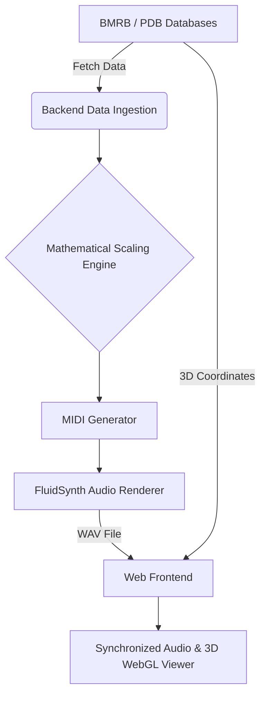

# Project Report: Cosmic Raga — Molecular Sonification System

## 1. Executive Summary

We built a data pipeline that turns molecular protein structures into audio. The system maps Nuclear Magnetic Resonance (NMR) chemical shifts into musical notes. We tackled a core data representation problem. Visualizing complex 2D protein data often hides subtle anomalies. By translating tabular data into a synchronized audio-visual stream, researchers can hear structural transitions in real-time. This report details the architecture, mathematical models, and software implementation of the project.

## 2. Introduction and Problem Statement

Most data science tools rely entirely on visual plotting. When biologists study protein structures using NMR spectroscopy, they look at dense 2D scatter plots (HSQC experiments). Each dot represents an amino acid residue. Staring at these plots tires the eyes, and spotting localized structural changes is difficult.

Human hearing excels at recognizing temporal patterns and sudden shifts. We decided to bridge this gap. We built a system that reads raw chemical shift data, processes it mathematically, and outputs an Indian Classical music composition where every note corresponds strictly to a data point.

## 3. System Architecture

The project splits into a Python processing backend and a web-based frontend.

The pipeline operates linearly. The backend handles heavy computation and audio rendering, while the frontend manages playback and live 3D visualization.

## 4. Data Ingestion and Preprocessing

The system pulls data from the Biological Magnetic Resonance Data Bank (BMRB) and the Protein Data Bank (PDB). We extract the amino acid sequence, NMR frequencies, and secondary structure into a clean tabular format.

An NMR experiment generates two distinct frequency coordinates for each residue: a Hydrogen shift (¹H) and a Nitrogen shift (¹⁵N). We measure these in parts per million (ppm). To use them mathematically, we convert the ppm values into Hertz based on the spectrometer's baseline power.

\[ f_H = \text{shift}_H \times 750 \text{ MHz} \]
\[ f_N = \text{shift}_N \times 75 \text{ MHz} \]

We combine these dimensions into a single effective frequency. We calculate the geometric mean to fuse the two values without letting one dominate the other.

\[ f_{\text{effective}} = \sqrt{f_H \times f_N} \]

This effective frequency acts as our primary data point.

## 5. Log-Exponential Frequency Scaling

The raw effective frequencies sit between 6,500 and 8,800 Hz. You cannot just play these as audio. They sit outside standard musical registers and sound grating. We run the raw values through a log-exponential scaling function to fix this.

Human pitch perception works logarithmically. An octave always represents a doubling of frequency. Our exponential transform keeps the relative contrast of the biological data intact while dropping the output into a listenable 240–480 Hz range.

First, we normalize the effective frequency \( x \) to a 0 to 1 scale:

\[ x_{\text{norm}} = \frac{x - x_{\text{min}}}{x_{\text{max}} - x_{\text{min}}} \]

Next, we apply an exponential curve:

\[ x_{\text{scaled}} = \frac{e^{x_{\text{norm}}} - 1}{e - 1} \]

Finally, we project this scaled value onto our target musical frequency range:

\[ f_{\text{musical}} = f_{\text{min}} + x_{\text{scaled}} \times (f_{\text{max}} - f_{\text{min}}) \]

## 6. MIDI Note Mapping and Quantization

With a usable audio frequency in hand, we map it to a digital music standard. We use the standard conversion formula to find the exact MIDI note:

\[ \text{MIDI}_{\text{raw}} = 69 + 12 \times \log_2 \left( \frac{f_{\text{musical}}}{440} \right) \]

A raw mapped MIDI note might land between standard piano keys. We handle this by quantizing the notes to an Indian Classical Raag scale, like Yaman or Bhairav. A Raag defines specific permitted semitone intervals from a root note.

Our algorithm grabs the raw MIDI note and snaps it to the nearest allowed semitone in the chosen Raag.

1. Find the degree within the 12-semitone octave:
\[ \text{degree} = (\text{MIDI}_{\text{raw}} - \text{root}) \bmod 12 \]

2. Search the Raag's permitted intervals to find the closest match:
\[ \text{interval}_{\text{closest}} = \text{argmin}_{i \in \text{Raag}} \, |i - \text{degree}| \]

3. Snap the raw note to this closest interval:
\[ \text{MIDI}_{\text{quantized}} = \text{MIDI}_{\text{raw}} - \text{degree} + \text{interval}_{\text{closest}} \]

We wrote the logic to guarantee it never reorders the data. A higher chemical shift always yields a higher pitch. The rounding just forces the output into a strict musical structure. That part is harder than it sounds. If you mess up the mapping, you ruin the scientific fidelity of the entire project.

## 7. Deterministic Dynamics and Structural Tension

In the original pipeline, note duration and volume included random variations. We removed this to guarantee scientific reproducibility. The pseudo-random engine is now seeded deterministically by hashing the exact amino acid sequence, ensuring identical inputs always produce identical compositions.

To bring the biological anomalies to life, we replaced randomized volume with a data-driven **deviation score**. We calculate how much each residue's frequency deviates from the average frequency of that specific amino acid type across the protein:

\[ \text{deviation}_i = | f_i - \bar{f}_{\text{aa}} | \]

This deviation is normalized and linearly scaled to control the MIDI note velocity (volume). 

Furthermore, we calculate a rolling variance (window size of 5) of the deviation score to quantify the local **structural tension**:

\[ \text{tension}_i = \text{Var}(\text{deviation}_{i-2} \dots \text{deviation}_{i+2}) \]

This normalized tension value controls an audio distortion effect applied during the final audio mixing stage. We use a hyperbolic tangent wave-shaper to saturate the audio signals of the rhythmic and accent tracks (Tabla and Sitar):

\[ \text{audio}_{\text{distorted}} = \tanh \left( \text{audio}_{\text{raw}} \times (1 + \text{tension} \times 15) \right) \]

This equation mathematically ensures that chaotic, disordered regions of the protein structure physically distort the rhythm, producing a grittier acoustic texture.

## 8. Acoustic Smoothing (LFO Filters)

To ensure the sonification sounds organic and soothing rather than like raw digital data, we modulate the synthesis using an LFO (Low-Frequency Oscillator) filter wobble.

Each structural state dictates a base filter cutoff (e.g., 110 for crisp Beta sheets, 75 for warm Alpha helices, 40 for muffled Random coils). We then calculate a sine wave wobble that oscillates at 0.25 Hz:

\[ \text{cutoff}_i = \text{cutoff}_{\text{base}} + 15 \times \sin(2 \pi \times 0.25 \times t_i) \]

Just before each note triggers, this $\text{cutoff}_i$ value is injected as a MIDI Control Change 74 (CC74) event. This continuous modulation strips away the harsh "MIDI" feel, yielding a breathing, underwater quality.

## 9. Software Implementation and Multi-Track Composition

The Python backend constructs a 5-track MIDI composition to build a full soundscape:

- **Track 0 (Santoor):** Plays the primary quantized notes. One note per residue.
- **Track 1 (Bansuri):** Plays an octave lower on a delay to create a natural echo.
- **Track 2 (Sitar):** Hits an accent note every eighth residue to mark structural sequences.
- **Track 3 (Tanpura):** Plays a continuous harmonic drone on the root notes, grounding the piece.
- **Track 4 (Tabla):** Drives a 16-beat Teentaal rhythm.

Proteins fold into physical shapes like alpha helices and beta sheets. We map these structural states to the track tempo. An alpha helix plays at 60 beats per minute. A beta sheet jumps to 80 beats per minute. A random coil slows down to 50 beats per minute. 

A listener hears the protein's physical shape change in real-time. The rhythm itself encodes the 3D topology.

We feed this complete MIDI file into FluidSynth using a custom SoundFont (`TimGM6mb.sf2`). FluidSynth renders the MIDI into a high-quality WAV audio file.

## 10. Frontend Visualization and Synchronization

On the frontend, a 3D WebGL molecular viewer runs in the browser. When the user hits play, the browser fetches the WAV file. As the audio plays, the viewer highlights the exact amino acid producing that sound on the 3D protein model. We built a live Heads-Up Display (HUD) that shows the current residue, the musical note, and the underlying frequency data. The audio and the visual model stay locked together.

## 11. Conclusion

We turned static tabular data into a time-series audio stream. This tool lets researchers hear structural transitions and outliers without relying solely on charts. The math stays rigorous, the software pipeline runs autonomously, and the output becomes something you can hear.
